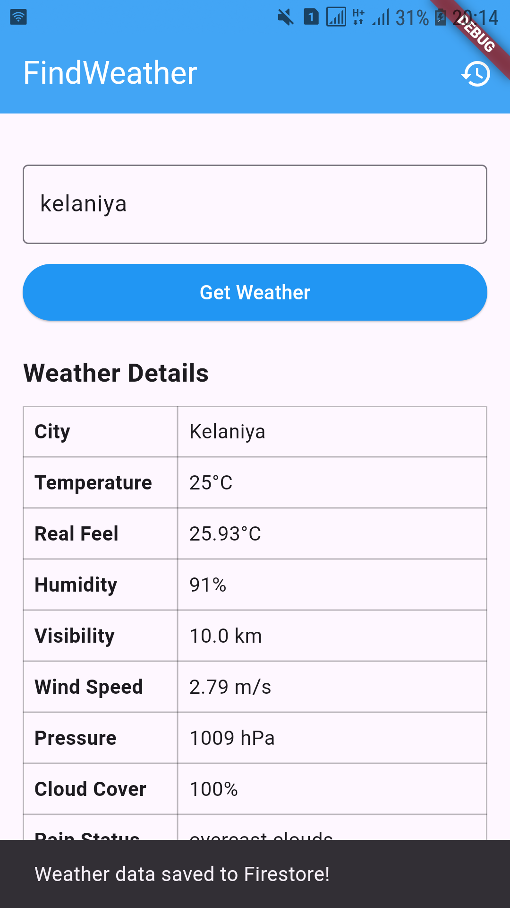
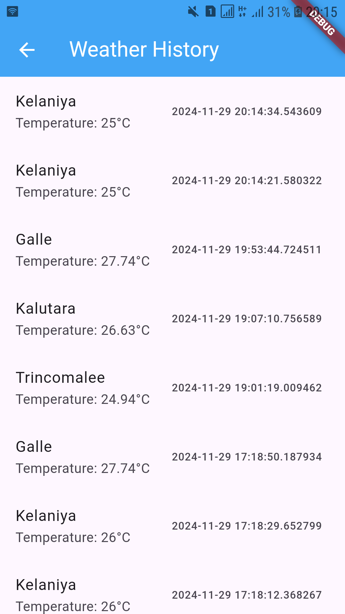

# weatherapp

|> About WeatherApp

WeatherApp is a Flutter-based mobile application developed as a university project for the University of Kelaniya. This app leverages the power of the OpenWeather API to provide users with real-time weather updates, forecasts, and weather-related insights in a visually appealing and user-friendly interface.

|> Key Features

      > Current Weather Data

      > Displays temperature, humidity, wind speed, and weather conditions for searched location.

      > Search Functionality

      > Allows users to search for weather updates in any city around the globe.

|> Technologies Used

      > Flutter Framework: For cross-platform mobile app development.

      > OpenWeather API: For accessing real-time and forecast weather data.
      
      > Dart Programming Language: To implement robust and efficient app logic.

#### Visuals

Below are some screenshots and design mockups of the app's interface:

1. **home**
   - Displays current weather conditions.
   

2. **history**
   - User interface for searching weather in different cities.
   

